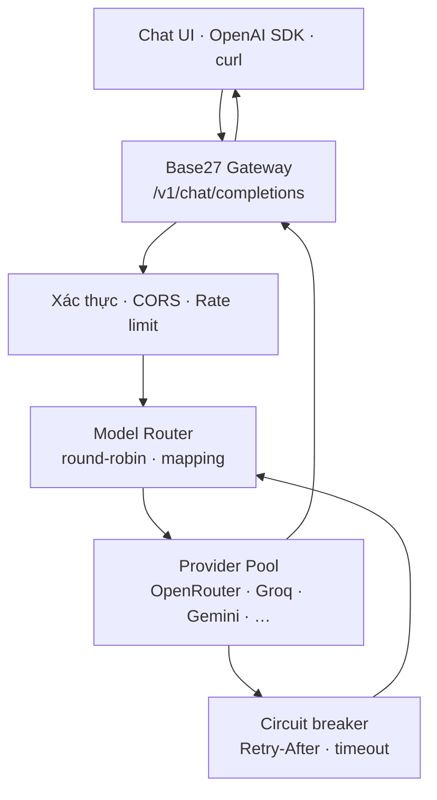

<div align="center">


# 🌐 Base27 Free LLM Router

### Gateway LLM miễn phí kiểu OpenRouter · API tương thích OpenAI · Chat Việt–Anh–Trung

[](README.md)
[](docs/README.en.md)
[](docs/README.zh-CN.md)
[](https://workers.cloudflare.com/)
[](#-api-tương-thích-openai)
[](https://github.com/Base27-CVNSS/DeepSeek-V4-Flash-0731-free-endpoint/actions)
[](LICENSE)

**[💬 Giao diện Chat](public/index.html)** · **[🚀 Triển khai](#-triển-khai-cloudflare-worker)** · **[🔌 API](#-api-tương-thích-openai)** · **[📚 Free‑LLM](https://github.com/nejib1/Free-LLM)**

</div>

> [!IMPORTANT]
> Endpoint DeepSeek‑V4‑Flash‑0731 miễn phí của Victor Mustar đã nghỉ. Dự án này được tái cấu trúc thành **gateway BYOK đa nhà cung cấp**: bạn tự tạo các API key thuộc free tier và lưu chúng dưới dạng secret phía máy chủ. Dự án **không cung cấp khóa dùng chung**, không xoay khóa/IP để né quota và không thể bảo đảm tuyệt đối 24/7 khi upstream miễn phí đều hết hạn mức.

---

## 🎯 Dự án này là gì?

Base27 Free LLM Router là một “OpenRouter thu nhỏ” có thể tự triển khai. Ứng dụng của bạn chỉ gọi một địa chỉ:

```text
POST https://<gateway-của-bạn>/v1/chat/completions
```

Gateway sẽ chọn một provider đã được cấu hình, ánh xạ model ảo sang model thật, chuyển tiếp request và trả về JSON theo cấu trúc Chat Completions. Khi provider gặp `429`, hết credit, timeout hoặc lỗi máy chủ, circuit breaker tạm ngưng provider đó và thử provider hợp lệ kế tiếp.

### Từ endpoint đơn sang router đa nguồn

| Phiên bản cũ | Phiên bản mới |
|---|---|
| Một endpoint DeepSeek do cộng đồng tài trợ | Tối đa 8 adapter provider do người vận hành tự cấu hình |
| URL bên thứ ba đã nghỉ | URL Cloudflare Worker thuộc tài khoản của bạn |
| Phụ thuộc một cụm GPU | Failover tuần tự giữa nhiều free tier |
| Một mô hình cố định | Model ảo `free/auto`, `fast`, `reasoning`, `coding` |
| Trang giới thiệu tiếng Anh | Chat và tài liệu Việt–Anh–Trung |
| Không kiểm soát khóa/quota | Secrets server-side, rate limit, CORS và gateway token |

---

## ✨ Tính năng

- 🔌 **OpenAI-compatible:** `/v1/chat/completions` và `/v1/models`.
- 🧭 **Định tuyến model ảo:** một model ID ổn định, model thật có thể đổi theo provider.
- 🔁 **Failover tuần tự:** không nhân đôi request và không tiêu quota đồng thời ở nhiều nơi.
- 🧯 **Circuit breaker:** tạm dừng provider khi `401/402/403/404/429/5xx` hoặc timeout.
- ⏱️ **Tôn trọng `Retry-After`:** provider bị 429 được nghỉ đúng khoảng thời gian công bố.
- 🔐 **BYOK an toàn:** khóa provider nằm trong Cloudflare secrets, không gửi xuống trình duyệt.
- 🚦 **Rate limit gateway:** token bucket theo IP ở mức best-effort.
- 🌍 **Ba ngôn ngữ:** giao diện và system prompt tiếng Việt, tiếng Anh, tiếng Trung giản thể.
- 💬 **Chat responsive:** desktop/mobile, lịch sử local, trạng thái provider, model selector.
- 🧪 **Kiểm thử tự động:** Node test cho routing, retry, model mapping và validation.
- 🧱 **Không phụ thuộc runtime library:** Worker gateway dùng Web APIs chuẩn.

---

## 🏗️ Kiến trúc



### Luồng một request

1. Client gửi `messages` cùng model ảo, ví dụ `free/auto`.
2. Gateway kiểm tra token, kích thước body, cấu trúc message và rate limit.
3. Router lọc các provider có secret và model mapping phù hợp.
4. Danh sách khỏe được xoay round-robin để phân phối tải hợp lệ.
5. Gateway chỉ gửi request tới **một provider tại một thời điểm**.
6. Nếu upstream trả lỗi có thể phục hồi, provider bị mở circuit và router thử nguồn tiếp theo.
7. Response thành công được stream/nguyên trạng về client, kèm header cho biết provider và model thật.

### Header quan sát

| Header | Ý nghĩa |
|---|---|
| `X-Base27-Provider` | Provider đã trả kết quả |
| `X-Base27-Model` | Model thật được provider sử dụng |
| `X-Base27-Attempts` | Số upstream đã thử cho request |

---

## 🌐 Danh sách provider

Free tier và model thay đổi thường xuyên. Bảng này mô tả adapter được tích hợp, không phải cam kết quota.

| Provider | Secret | Base URL | Model mặc định | Phân loại |
|---|---|---|---|---|
| [OpenRouter](https://openrouter.ai/docs/guides/routing/routers/free-router) | `OPENROUTER_API_KEY` | `openrouter.ai/api/v1` | `openrouter/free` | Free Router, giới hạn thấp |
| [Groq](https://console.groq.com/docs/rate-limits) | `GROQ_API_KEY` | `api.groq.com/openai/v1` | Llama/GPT‑OSS theo mục đích | Free plan theo model |
| [Google AI Studio](https://ai.google.dev/gemini-api/docs/rate-limits) | `GEMINI_API_KEY` | Gemini OpenAI endpoint | `gemini-3.6-flash` | Free tier theo dự án/khu vực |
| [Cerebras](https://inference-docs.cerebras.ai/support/rate-limits) | `CEREBRAS_API_KEY` | `api.cerebras.ai/v1` | `gpt-oss-120b` | Free trial/credit; có thể cần payment method |
| [Mistral](https://docs.mistral.ai/admin/billing-usage/usage-limits) | `MISTRAL_API_KEY` | `api.mistral.ai/v1` | `mistral-small-latest` | Free mode có hạn mức |
| [NVIDIA NIM](https://build.nvidia.com/explore/discover) | `NVIDIA_API_KEY` | `integrate.api.nvidia.com/v1` | Llama/DeepSeek | Quyền truy cập developer có giới hạn |
| [Z.AI](https://docs.z.ai/guides/llm/glm-4.7) | `ZAI_API_KEY` | `api.z.ai/api/paas/v4` | `glm-4.7-flash` | Flash/best-effort; kiểm tra tài khoản |
| [Hugging Face](https://huggingface.co/docs/inference-providers/en/index) | `HF_TOKEN` + `HF_MODEL` | `router.huggingface.co/v1` | Người vận hành chọn | Credit/provider-dependent |

> [!NOTE]
> Dữ liệu ban đầu được khám phá qua [nejib1/Free‑LLM](https://github.com/nejib1/Free-LLM), sau đó endpoint/model quan trọng được đối chiếu với tài liệu chính thức. Không nên xem bất kỳ bảng quota tĩnh nào là “vĩnh viễn”.

---

## 🧭 Model ảo

| Model gửi vào gateway | Mục tiêu | Ví dụ model thật |
|---|---|---|
| `free/auto` | Cân bằng chung | OpenRouter Free, Llama 70B, Gemini Flash |
| `free/fast` | Ưu tiên độ trễ | Llama 8B Instant, Gemini Flash |
| `free/reasoning` | Suy luận | GPT‑OSS 120B, Gemini thinking, DeepSeek R1 qua NVIDIA |
| `free/coding` | Viết và phân tích mã | GPT‑OSS, Codestral, GLM Flash |

Muốn khóa vào một provider/model cụ thể, dùng cú pháp:

```text
provider::model-id
```

Ví dụ:

```text
groq::openai/gpt-oss-120b
gemini::gemini-3.6-flash
openrouter::openrouter/free
```

Model mặc định có thể được thay bằng biến môi trường như `GROQ_MODEL_FAST`, `GEMINI_MODEL` hoặc `NVIDIA_MODEL_REASONING` mà không sửa mã.

---

## 🚀 Triển khai Cloudflare Worker

### 1. Chuẩn bị

- Tài khoản Cloudflare.
- Node.js 20 trở lên.
- Ít nhất một API key từ provider mà bạn có quyền sử dụng.
- Không dán API key vào Issue, README, frontend hoặc cuộc trò chuyện công khai.

### 2. Cài đặt

```bash
git clone https://github.com/Base27-CVNSS/DeepSeek-V4-Flash-0731-free-endpoint.git
cd DeepSeek-V4-Flash-0731-free-endpoint
npm install
npx wrangler login
```

### 3. Lưu secrets

Chỉ cần cấu hình các provider bạn có tài khoản:

```bash
npx wrangler secret put OPENROUTER_API_KEY
npx wrangler secret put GROQ_API_KEY
npx wrangler secret put GEMINI_API_KEY
npx wrangler secret put CEREBRAS_API_KEY
```

Nên bảo vệ gateway riêng:

```bash
npx wrangler secret put GATEWAY_TOKEN
```

### 4. Cấu hình domain và giới hạn

Sửa phần `[vars]` trong `wrangler.toml`:

```toml
APP_URL = "https://chat.example.com"
ALLOWED_ORIGINS = "https://chat.example.com"
PUBLIC_RPM = "30"
PUBLIC_BURST = "20"
MAX_PROVIDER_ATTEMPTS = "5"
UPSTREAM_TIMEOUT_MS = "60000"
```

### 5. Kiểm thử và triển khai

```bash
npm run check
npm run deploy
```

Cloudflare sẽ trả về URL `workers.dev`. Mở URL đó để dùng giao diện chat; assets và gateway được phục vụ trong cùng Worker.

> [!CAUTION]
> Một gateway công khai không có xác thực có thể bị người khác tiêu hết quota. Với nhóm nhỏ, hãy đặt `GATEWAY_TOKEN`. Với dịch vụ công cộng, cần bổ sung Turnstile, rate limiting bền vững/KV và chính sách sử dụng trước khi quảng bá URL.

---

## 🔌 API tương thích OpenAI

### `curl`

```bash
curl https://your-worker.workers.dev/v1/chat/completions \
  -H "Authorization: Bearer $GATEWAY_TOKEN" \
  -H "Content-Type: application/json" \
  -d '{
    "model": "free/auto",
    "messages": [
      {"role": "system", "content": "Trả lời bằng tiếng Việt."},
      {"role": "user", "content": "Giải thích circuit breaker."}
    ]
  }'
```

### Python OpenAI SDK

```python
from openai import OpenAI

client = OpenAI(
    base_url="https://your-worker.workers.dev/v1",
    api_key="YOUR_GATEWAY_TOKEN",
)

response = client.chat.completions.create(
    model="free/reasoning",
    messages=[{"role": "user", "content": "Phân tích kiến trúc MoE."}],
)

print(response.choices[0].message.content)
```

### JavaScript

```javascript
const response = await fetch("https://your-worker.workers.dev/v1/chat/completions", {
  method: "POST",
  headers: {
    Authorization: `Bearer ${GATEWAY_TOKEN}`,
    "Content-Type": "application/json",
  },
  body: JSON.stringify({
    model: "free/coding",
    messages: [{ role: "user", content: "Viết REST API bằng Go." }],
  }),
});

console.log(await response.json());
```

### Endpoint hệ thống

| Phương thức | Đường dẫn | Mục đích |
|---|---|---|
| `POST` | `/v1/chat/completions` | Chat Completions |
| `GET` | `/v1/models` | Danh sách model ảo |
| `GET` | `/health` | Trạng thái cấu hình |
| `GET` | `/api/status` | Provider và circuit hiện tại |

---

## 🧯 Failover hoạt động thế nào?

| Tình huống upstream | Hành động |
|---|---|
| `200–299` | Trả response ngay; đóng circuit provider |
| `400/422` | Dừng, vì payload client có khả năng sai |
| `401/403` | Tạm dừng provider; thử provider kế tiếp |
| `402` | Xem như hết credit; tạm dừng provider |
| `404` | Model/route không còn; tạm dừng provider |
| `429` | Đọc `Retry-After`, mở circuit và failover |
| `5xx` hoặc timeout | Circuit 30 giây rồi thử nguồn khác |

Gateway không retry vô hạn. `MAX_PROVIDER_ATTEMPTS` giới hạn số nguồn được thử. Streaming được chuyển tiếp sau khi upstream trả `2xx`; nếu luồng đã bắt đầu rồi bị đứt, không thể chuyển provider mà không làm trùng một phần câu trả lời.

---

## 🔐 Bảo mật và quyền riêng tư

- Provider keys phải lưu bằng `wrangler secret put`.
- `.dev.vars` đã nằm trong `.gitignore`.
- Frontend chỉ nhận gateway token tùy chọn, lưu trong `sessionStorage` của tab.
- Không ghi nội dung prompt hoặc provider key vào log mặc định.
- CORS không phải cơ chế chống bot; nó chỉ kiểm soát trình duyệt tuân chuẩn.
- Rate limit trong Worker hiện là best-effort theo isolate, không phải quota phân tán tuyệt đối.
- Dữ liệu vẫn đi qua provider được chọn. Hãy đọc chính sách lưu trữ và huấn luyện của từng provider.
- Không dùng free tier cho dữ liệu y tế, pháp lý, tài chính hoặc bí mật chưa được phê duyệt.

---

## ⏰ Về mục tiêu vận hành 24/7

Kiến trúc loại bỏ “điểm lỗi duy nhất” ở tầng model provider, nhưng **không thể bảo đảm 100% uptime miễn phí**.

Khả dụng thực tế phụ thuộc:

- Cloudflare Worker và domain của bạn.
- API key còn hiệu lực và đúng quyền.
- Quota theo phút/ngày/tháng của từng tài khoản.
- Model không bị nhà cung cấp đổi tên hoặc gỡ.
- Tất cả provider không cùng hết quota tại một thời điểm.

Để tiến gần production:

1. Cấu hình ít nhất ba provider độc lập.
2. Bật cảnh báo `/health` và kiểm tra định kỳ, không gọi model chỉ để “giữ nóng”.
3. Giữ một provider trả phí giới hạn ngân sách làm fallback cuối.
4. Dùng Durable Objects/KV cho rate limit và circuit state bền vững.
5. Không tạo nhiều tài khoản, key hoặc IP nhằm lách giới hạn miễn phí.

---

## 🧪 Phát triển và kiểm thử

```bash
npm install
npm test
npm run check
npm run dev
```

Bộ test hiện kiểm tra:

- Ánh xạ model ảo sang model provider.
- Target `provider::model`.
- Chuẩn hóa các field Groq không hỗ trợ.
- Failover sau `429`.
- Dừng đúng với lỗi client không retry được.
- Lỗi rõ ràng khi chưa cấu hình secret.
- Validation message và rate limiter.

---

## 📂 Cấu trúc thư mục

```text
.
├── public/                 # Chat UI Việt–Anh–Trung
├── src/
│   ├── index.js            # HTTP API, auth, CORS, rate limit
│   ├── providers.js        # Adapter, model mapping, payload normalization
│   └── router.js           # Round-robin, circuit breaker, failover
├── tests/                  # Node test
├── docs/                   # README English/中文 và lịch sử endpoint
├── wrangler.toml           # Cloudflare Worker + static assets
├── .dev.vars.example       # Danh sách secret/config mẫu
└── NOTICE.md               # Ghi công nguồn
```

---

## 📚 Nguồn và ghi công

| Thành phần | Nguồn |
|---|---|
| Danh mục khám phá free API | [nejib1/Free‑LLM](https://github.com/nejib1/Free-LLM), MIT |
| Free Models Router | [OpenRouter documentation](https://openrouter.ai/docs/guides/routing/routers/free-router) |
| Space lịch sử đã nghỉ | [Victor Mustar trên Hugging Face](https://huggingface.co/spaces/victor/DeepSeek-V4-Flash-0731-free-endpoint) |
| Mô hình lịch sử | [DeepSeek‑V4‑Flash‑0731](https://huggingface.co/deepseek-ai/DeepSeek-V4-Flash-0731) |
| Phiên bản tái cấu trúc | Base27‑CVNSS |

Xem đầy đủ tại [NOTICE.md](NOTICE.md). Việc hỗ trợ adapter không có nghĩa Base27‑CVNSS được các nhà cung cấp tài trợ hoặc chứng thực.

## 📄 Giấy phép

Mã nguồn được phát hành theo [MIT License](LICENSE). Quyền sử dụng API/model bên thứ ba vẫn tuân theo điều khoản và giấy phép riêng của từng nguồn.

---

<div align="center">

### Base<span style="color:#3b82f6">27</span> · Một API, nhiều lựa chọn, failover có trách nhiệm

**[⬆ Về đầu trang](#-base27-free-llm-router)**

</div>
