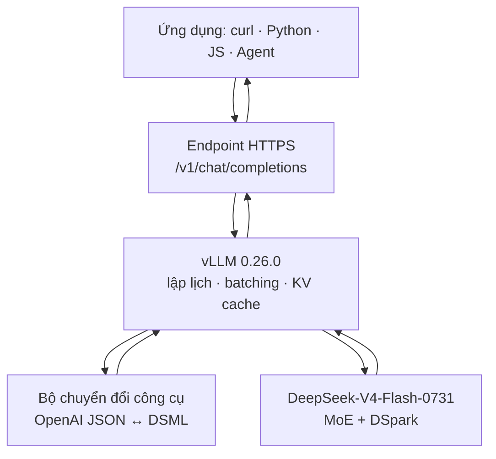

<div align="center">

# 🐋 DeepSeek‑V4‑Flash‑0731 — Endpoint miễn phí

### Tài liệu tiếng Việt về API cộng đồng tương thích OpenAI trên Hugging Face

[](#-mục-lục)
[](https://huggingface.co/deepseek-ai/DeepSeek-V4-Flash-0731)
[](#-gọi-api-trong-30-giây)
[](https://huggingface.co/spaces/victor/DeepSeek-V4-Flash-0731-free-endpoint)
[](https://huggingface.co/deepseek-ai/DeepSeek-V4-Flash-0731/blob/main/LICENSE)

**[🚀 Mở Space gốc](https://huggingface.co/spaces/victor/DeepSeek-V4-Flash-0731-free-endpoint)** · **[💬 Mở giao diện Chat](https://victor-chat-with-deepseek-flash-0731.hf.space)** · **[🤗 Trang mô hình](https://huggingface.co/deepseek-ai/DeepSeek-V4-Flash-0731)** · **[📄 Báo cáo kỹ thuật](https://arxiv.org/abs/2606.19348)**

</div>

> [!IMPORTANT]
> Đây là **tài liệu Việt hóa và hướng dẫn tích hợp**, không phải kho trọng số, mã huấn luyện hay máy chủ của DeepSeek. Endpoint công khai do **Victor Mustar (`victor`)** chia sẻ trên Hugging Face; mô hình do **DeepSeek‑AI** phát triển. Dịch vụ miễn phí có thể đổi URL, giới hạn, phần cứng hoặc ngừng hoạt động bất cứ lúc nào.

---

## 📌 Tóm tắt

Space gốc cung cấp một cổng thử nghiệm công khai để gọi **DeepSeek‑V4‑Flash‑0731** bằng giao thức gần tương thích API `Chat Completions` của OpenAI. Người dùng không phải tải hàng trăm tỷ tham số về máy và không cần Hugging Face Token ở cấu hình công khai hiện tại. Chỉ cần gửi JSON tới `/v1/chat/completions` bằng `curl`, Python, JavaScript hoặc một ứng dụng đã hỗ trợ nhà cung cấp kiểu OpenAI.

Điểm cần hiểu đúng: “miễn phí” chỉ mô tả **endpoint cộng đồng hiện tại**, không phải cam kết rằng mọi hình thức triển khai DeepSeek‑V4 đều miễn phí. Nếu tự tạo Hugging Face Inference Endpoint hoặc tự vận hành cụm GPU, người triển khai vẫn chịu chi phí phần cứng và hạ tầng.

### Thông số nhanh

| Hạng mục | Giá trị được công bố | Ý nghĩa thực tế |
|---|---:|---|
| Mô hình | `deepseek-ai/DeepSeek-V4-Flash-0731` | Bản Flash chính thức ngày 31/07, thay thế bản xem trước |
| Loại mô hình | Mixture of Experts — MoE | Chỉ một nhóm chuyên gia được kích hoạt cho mỗi token |
| Chuyên gia hoạt động | 6/256 theo Space gốc | Giảm lượng tính toán so với kích hoạt toàn bộ chuyên gia |
| Tham số kích hoạt | khoảng 13B theo báo cáo kỹ thuật | Không đồng nghĩa mô hình chỉ có 13B tham số lưu trữ |
| Ngữ cảnh cấp mô hình | tới 1.048.576 token | Năng lực kiến trúc; không phải giới hạn chắc chắn của mọi endpoint |
| Ngữ cảnh endpoint công khai | tối đa 393.216 token theo Space | Tổng ngân sách thực tế còn phụ thuộc prompt, đầu ra và cấu hình máy chủ |
| Máy chủ được công bố | 4× NVIDIA H200 | Suy luận chạy từ xa, không chạy trên máy người dùng |
| Engine | vLLM 0.26.0 theo Space | Phục vụ API, lập lịch request và giải mã token |
| Tăng tốc giải mã | DSpark speculative decoding | Dự đoán trước rồi xác minh token để tăng thông lượng |
| Giao thức | OpenAI‑compatible Chat Completions | Dễ tích hợp vào SDK và công cụ có sẵn |
| Tool calling | OpenAI `tools` / `tool_calls` | Máy chủ chuyển đổi qua lại với định dạng nội bộ DSML |
| Xác thực hiện tại | Không yêu cầu HF Token | SDK vẫn có thể đòi một chuỗi `api_key` không rỗng |
| Giấy phép nguồn | MIT | Áp dụng theo giấy phép tại kho mô hình và Space gốc |

---

## 🧭 Mục lục

- [Bản chất của dự án](#-bản-chất-của-dự-án)
- [Kiến trúc và luồng xử lý](#-kiến-trúc-và-luồng-xử-lý)
- [Nguyên lý kỹ thuật của mô hình](#-nguyên-lý-kỹ-thuật-của-mô-hình)
- [Gọi API trong 30 giây](#-gọi-api-trong-30-giây)
- [Điều khiển mức suy luận](#-điều-khiển-mức-suy-luận)
- [Gọi công cụ](#-gọi-công-cụ-tool-calling)
- [Giới hạn tốc độ và xử lý lỗi](#-giới-hạn-tốc-độ-và-xử-lý-lỗi)
- [Tích hợp vào ứng dụng](#-tích-hợp-vào-ứng-dụng)
- [Khi nào nên và không nên dùng](#-khi-nào-nên-và-không-nên-dùng)
- [Triển khai riêng và yêu cầu phần cứng](#-triển-khai-riêng-và-yêu-cầu-phần-cứng)
- [Đánh giá và giới hạn khoa học](#-đánh-giá-và-giới-hạn-khoa-học)
- [Nguồn, ghi công và giấy phép](#-nguồn-ghi-công-và-giấy-phép)

---

## 🔎 Bản chất của dự án

Hệ thống cần được nhìn thành ba lớp độc lập:

| Lớp | Thành phần | Vai trò |
|---|---|---|
| **Mô hình** | DeepSeek‑V4‑Flash‑0731 | Nhận chuỗi token và sinh token tiếp theo; thực hiện suy luận, viết mã, gọi công cụ |
| **Máy chủ suy luận** | vLLM + bộ phân tích tool call + DSpark | Nạp trọng số lên GPU, quản lý KV cache, batching, giải mã và trả JSON |
| **Điểm truy cập** | Hugging Face Inference Endpoint do `victor` chia sẻ | Cung cấp URL HTTPS công khai, tương thích kiểu OpenAI và áp dụng rate limit |

Kho này chỉ bổ sung **lớp tài liệu tiếng Việt** cho ba thành phần trên. Nó không sao chép trọng số mô hình và cũng không biến endpoint cộng đồng thành dịch vụ do Base27‑CVNSS vận hành.

### Endpoint này giải quyết vấn đề gì?

- 🧪 Thử nhanh mô hình mà không cần sở hữu cụm GPU lớn.
- 🔌 Kiểm tra khả năng tương thích của ứng dụng đang dùng OpenAI SDK.
- 🤖 Thử agent, sinh mã và gọi công cụ trước khi đầu tư hạ tầng riêng.
- 📚 Nghiên cứu cách `reasoning_effort`, context dài và speculative decoding ảnh hưởng trải nghiệm.
- 🧱 Làm adapter ban đầu cho chatbot, CLI, IDE hoặc quy trình tự động hóa.

### Endpoint này không phải là gì?

- Không phải API chính thức có SLA của DeepSeek.
- Không phải cam kết miễn phí vĩnh viễn.
- Không phải môi trường phù hợp để gửi mật khẩu, dữ liệu cá nhân hoặc bí mật doanh nghiệp.
- Không phải bản chạy local cho laptop/CPU phổ thông.
- Không bảo đảm mọi tham số của OpenAI API đều được hỗ trợ giống hệt 100%.

---

## 🏗️ Kiến trúc và luồng xử lý



### Luồng của một yêu cầu

1. Ứng dụng đóng gói lịch sử hội thoại trong mảng `messages`.
2. HTTPS request được gửi tới endpoint công khai.
3. Lớp giới hạn tốc độ kiểm tra lưu lượng theo địa chỉ IP.
4. vLLM mã hóa prompt, phân bổ KV cache và đưa request vào batch phù hợp.
5. Router MoE chọn nhóm chuyên gia cần thiết cho từng token.
6. DSpark đề xuất trước một số token; mô hình đích kiểm tra và chấp nhận hoặc loại bỏ.
7. Nếu mô hình cần gọi hàm, biểu diễn nội bộ DSML được parser chuyển thành `tool_calls` kiểu OpenAI.
8. Máy chủ trả về JSON; ứng dụng đọc `choices[0].message` và tiếp tục vòng hội thoại hoặc thực thi công cụ.

### Hai vòng lặp của agent

| Kiểu xử lý | Trình tự |
|---|---|
| Trả lời trực tiếp | Người dùng → mô hình → câu trả lời cuối |
| Dùng công cụ | Người dùng → mô hình → `tool_calls` → ứng dụng chạy công cụ → gửi kết quả công cụ về mô hình → câu trả lời cuối |

Mô hình chỉ **đề nghị** gọi công cụ. Chính chương trình của bạn phải xác thực đối số, thực thi hàm, thu kết quả rồi gửi kết quả đó về mô hình. Không nên cấp quyền hệ thống trực tiếp cho nội dung do mô hình sinh ra.

---

## 🧠 Nguyên lý kỹ thuật của mô hình

### 1. Mixture of Experts: lớn về dung lượng, thưa khi tính toán

MoE chứa nhiều mạng con chuyên biệt gọi là *expert*. Với mỗi token, router chỉ chọn một số expert phù hợp thay vì chạy toàn bộ mạng. Space mô tả cấu hình **6 trong 256 expert hoạt động cho mỗi token**; báo cáo kỹ thuật nêu khoảng **13B tham số được kích hoạt** đối với DeepSeek‑V4‑Flash.

Lợi ích chính là giữ dung lượng biểu diễn lớn nhưng giảm FLOPs trên mỗi token. Đổi lại, hệ thống cần router tốt, liên lạc GPU nhanh, expert parallelism và cân bằng tải chặt chẽ. Vì vậy “chỉ kích hoạt 13B” không có nghĩa checkpoint có thể chạy như một mô hình dense 13B trên máy 16 GB RAM.

### 2. Kiến trúc attention lai cho ngữ cảnh dài

Báo cáo DeepSeek‑V4 mô tả hai cơ chế attention phối hợp:

- **Compressed Sparse Attention — CSA:** tập trung phép tính vào các vị trí quan trọng thay vì so sánh dày đặc mọi cặp token.
- **Heavily Compressed Attention — HCA:** nén mạnh biểu diễn lịch sử để giảm chi phí bộ nhớ trong ngữ cảnh rất dài.

Mục tiêu là giảm độ phức tạp thực tế và KV cache khi làm việc với tài liệu hoặc tiến trình agent dài. Context lớn vẫn không bảo đảm mô hình nhớ chính xác mọi chi tiết; chất lượng còn phụ thuộc vị trí thông tin, prompt, truy hồi và quá trình hậu huấn luyện.

### 3. Manifold‑Constrained Hyper‑Connections — mHC

mHC mở rộng đường truyền residual giữa các lớp nhưng ràng buộc phép trộn trên một miền hình học ổn định. Theo báo cáo, cơ chế này nhằm cải thiện dòng thông tin và độ ổn định khi huấn luyện mạng rất sâu.

### 4. Bộ tối ưu Muon

DeepSeek‑V4 dùng Muon trong quá trình tiền huấn luyện để tăng tốc hội tụ và cải thiện độ ổn định. Đây là kỹ thuật **huấn luyện**, không phải một tham số API mà người dùng endpoint có thể bật hoặc tắt.

### 5. DSpark speculative decoding

Giải mã tự hồi quy thông thường phải chờ token trước hoàn tất rồi mới tính token sau. Speculative decoding tạo trước một chuỗi ứng viên và để mô hình đích xác minh nhiều vị trí trong một lượt. Nếu dự đoán tốt, nhiều token được chấp nhận cùng lúc; nếu sai, hệ thống quay về nhánh đã xác minh.

DeepSeek‑V4‑Flash‑0731 gắn mô‑đun DSpark ngay trong checkpoint. Trên vLLM, Space gốc mô tả cấu hình dự đoán trước 7 token theo chiến lược greedy. Tốc độ thực tế vẫn phụ thuộc độ dài prompt, batching, mạng, mức reasoning và tỷ lệ token được chấp nhận.

---

## ⚡ Gọi API trong 30 giây

### URL hiện được Space công bố

```text
https://q5dh1rfszfym23hj.us-east-2.aws.endpoints.huggingface.cloud/v1
```

> [!WARNING]
> Đây là URL hạ tầng cộng đồng, không phải tên miền ổn định do dự án này kiểm soát. Hãy đặt nó trong biến môi trường hoặc tệp cấu hình để có thể thay đổi mà không sửa mã nguồn.

### Cách 1 — `curl`

```bash
curl --request POST \
  "https://q5dh1rfszfym23hj.us-east-2.aws.endpoints.huggingface.cloud/v1/chat/completions" \
  --header "Content-Type: application/json" \
  --data '{
    "model": "deepseek-ai/DeepSeek-V4-Flash-0731",
    "messages": [
      {"role": "system", "content": "Bạn là trợ lý kỹ thuật, trả lời bằng tiếng Việt."},
      {"role": "user", "content": "Giải thích MoE bằng một ví dụ dễ hiểu."}
    ],
    "reasoning_effort": "high",
    "temperature": 1.0,
    "top_p": 0.95
  }'
```

### Cách 2 — Python với OpenAI SDK

Cài thư viện:

```bash
python -m pip install --upgrade openai
```

Tạo `client.py`:

```python
from openai import OpenAI

BASE_URL = (
    "https://q5dh1rfszfym23hj.us-east-2.aws.endpoints."
    "huggingface.cloud/v1"
)

client = OpenAI(
    base_url=BASE_URL,
    # SDK yêu cầu chuỗi không rỗng; endpoint công khai hiện không kiểm tra token này.
    api_key="public-endpoint",
)

response = client.chat.completions.create(
    model="deepseek-ai/DeepSeek-V4-Flash-0731",
    messages=[
        {"role": "system", "content": "Luôn trả lời bằng tiếng Việt rõ ràng."},
        {"role": "user", "content": "DSpark giúp tăng tốc như thế nào?"},
    ],
    temperature=1.0,
    top_p=0.95,
    extra_body={"reasoning_effort": "max"},
)

print(response.choices[0].message.content)
```

Chạy:

```bash
python client.py
```

### Cách 3 — JavaScript `fetch`

```javascript
const baseUrl =
  "https://q5dh1rfszfym23hj.us-east-2.aws.endpoints.huggingface.cloud/v1";

async function chat(prompt) {
  const response = await fetch(`${baseUrl}/chat/completions`, {
    method: "POST",
    headers: { "Content-Type": "application/json" },
    body: JSON.stringify({
      model: "deepseek-ai/DeepSeek-V4-Flash-0731",
      messages: [{ role: "user", content: prompt }],
      reasoning_effort: "high",
      temperature: 1.0,
      top_p: 0.95,
    }),
  });

  if (response.status === 429) {
    const retryAfter = response.headers.get("Retry-After") ?? "một lúc";
    throw new Error(`Đang bị giới hạn tốc độ; thử lại sau ${retryAfter} giây.`);
  }

  if (!response.ok) {
    throw new Error(`HTTP ${response.status}: ${await response.text()}`);
  }

  const data = await response.json();
  return data.choices?.[0]?.message?.content ?? "";
}

chat("Viết một hàm kiểm tra số nguyên tố bằng JavaScript.")
  .then(console.log)
  .catch(console.error);
```

> [!CAUTION]
> Gọi endpoint trực tiếp từ trình duyệt sẽ làm URL và mọi header xuất hiện ở phía người dùng. Với ứng dụng thật, nên đi qua backend của bạn để kiểm soát quota, nhật ký, timeout và chính sách dữ liệu.

---

## 🎚️ Điều khiển mức suy luận

Mô hình chính thức công bố ba mức `low`, `high`, `max`. Tuy nhiên, Space ghi rõ trên triển khai vLLM 0.26.0 hiện tại, `low` và `high` hoạt động tương đương; chỉ `max` thêm chỉ thị nỗ lực tối đa.

| Giá trị gửi lên | Hành vi tại endpoint cộng đồng | Nên dùng khi |
|---|---|---|
| Bỏ qua trường | Không bật reasoning; phản hồi nhanh nhất | Hỏi đáp ngắn, trích xuất, phân loại đơn giản |
| `"low"` | Bật chế độ suy luận | Bài toán cần phân tích nhưng ưu tiên độ trễ |
| `"high"` | Hiện tương đương `low` trên endpoint này | Agent, lập trình, kế hoạch nhiều bước |
| `"max"` | Suy luận với chỉ thị nỗ lực tối đa | Bài toán khó; chấp nhận chậm và tốn token hơn |

### Sampling được khuyến nghị

| Tình huống | `temperature` | `top_p` |
|---|---:|---:|
| Agent và gọi công cụ | `1.0` | `0.95` |
| Trò chuyện/sinh nội dung thông thường | `1.0` | `1.0` |

Không nên mặc định `max` cho mọi request: thời gian phản hồi và lượng token có thể tăng mạnh, trong khi tác vụ đơn giản thường không hưởng lợi tương xứng.

---

## 🛠️ Gọi công cụ — Tool calling

Endpoint nhận lược đồ công cụ theo kiểu OpenAI. Ví dụ Python:

```python
tools = [
    {
        "type": "function",
        "function": {
            "name": "get_weather",
            "description": "Tra cứu thời tiết tại một địa điểm",
            "parameters": {
                "type": "object",
                "properties": {
                    "location": {
                        "type": "string",
                        "description": "Tên thành phố, ví dụ Vĩnh Long",
                    }
                },
                "required": ["location"],
                "additionalProperties": False,
            },
        },
    }
]

response = client.chat.completions.create(
    model="deepseek-ai/DeepSeek-V4-Flash-0731",
    messages=[{"role": "user", "content": "Thời tiết Vĩnh Long hôm nay thế nào?"}],
    tools=tools,
    tool_choice="auto",
)

message = response.choices[0].message
for call in message.tool_calls or []:
    print(call.function.name, call.function.arguments)
```

### Quy tắc an toàn cho agent

- Chỉ cho phép gọi các hàm nằm trong danh sách trắng.
- Kiểm tra JSON bằng schema trước khi thực thi.
- Yêu cầu xác nhận của con người với thao tác gửi, mua, xóa hoặc thay đổi dữ liệu.
- Đặt timeout, giới hạn kích thước đầu ra và số vòng lặp agent.
- Không đưa khóa API, mật khẩu hoặc bí mật hệ thống vào prompt.
- Ghi log tên công cụ và kết quả, nhưng che dữ liệu nhạy cảm.

---

## 🚦 Giới hạn tốc độ và xử lý lỗi

Theo thông báo trên Space gốc tại thời điểm biên soạn, endpoint cho phép khoảng **20 request trong một đợt** và hồi lại xấp xỉ **12 request/phút/IP**. Đây là mô tả vận hành, không phải SLA và có thể được thay đổi mà không báo trước.

| Mã lỗi | Nguyên nhân thường gặp | Cách xử lý |
|---:|---|---|
| `400` | JSON sai, tham số không hỗ trợ, lịch sử chat không hợp lệ | Kiểm tra payload và giảm các trường tùy chọn |
| `404` | URL/model đã đổi hoặc endpoint bị gỡ | Mở Space gốc để lấy URL mới |
| `408` / timeout | Prompt dài, reasoning cao hoặc hàng đợi bận | Tăng timeout hợp lý, rút gọn context, thử lại có kiểm soát |
| `429` | Vượt giới hạn theo IP | Đọc `Retry-After`, chờ rồi retry với exponential backoff |
| `5xx` | Máy chủ, GPU hoặc engine tạm lỗi | Retry có jitter; không lặp vô hạn |

### Backoff gợi ý

```text
lần 1: chờ 1–2 giây
lần 2: chờ 2–4 giây
lần 3: chờ 4–8 giây
sau đó: dừng và báo lỗi cho người dùng
```

Không dùng nhiều luồng để né giới hạn. Nếu ứng dụng cần tải ổn định, hãy triển khai endpoint riêng hoặc chọn nhà cung cấp có quota và SLA phù hợp.

---

## 🔌 Tích hợp vào ứng dụng

### Mẫu cấu hình chung

```env
DEEPSEEK_BASE_URL=https://q5dh1rfszfym23hj.us-east-2.aws.endpoints.huggingface.cloud/v1
DEEPSEEK_MODEL=deepseek-ai/DeepSeek-V4-Flash-0731
DEEPSEEK_API_KEY=public-endpoint
```

Đưa ba giá trị này vào cấu hình thay vì viết cứng trong mã. Khi endpoint thay đổi, chỉ cần cập nhật môi trường.

### Tương thích thực tế

| Khả năng | Trạng thái theo Space | Lưu ý |
|---|---|---|
| Chat Completions | ✅ | Đường dẫn `/v1/chat/completions` |
| `messages` nhiều lượt | ✅ | Giữ đúng vai trò `system`, `user`, `assistant`, `tool` |
| `reasoning_effort` | ✅ | Hành vi riêng của triển khai này |
| Tool calling | ✅ | Parser đổi OpenAI JSON ↔ DSML nội bộ |
| Streaming | ⚠️ Cần kiểm thử | Không nên giả định mọi SDK/kiểu chunk đều giống OpenAI |
| Structured output/JSON schema | ⚠️ Chưa được Space cam kết | Kiểm tra và sửa JSON ở phía ứng dụng |
| Audio, ảnh, video | ❌ Không được công bố | Mô hình/endpoint được mô tả cho đầu vào văn bản |
| SLA và quota riêng | ❌ | Đây là tài nguyên cộng đồng dùng chung |

---

## ✅ Khi nào nên và không nên dùng

### Nên dùng

- Proof of concept, demo, học API và thử prompt.
- Đánh giá năng lực sinh mã hoặc agent trên dữ liệu không nhạy cảm.
- Kiểm tra adapter cho ứng dụng tương thích OpenAI.
- So sánh chất lượng các mức reasoning trước khi chọn hạ tầng.
- Thử tool calling với tần suất thấp và có người giám sát.

### Không nên dùng

- Dịch vụ sản xuất cần uptime, SLA và hỗ trợ chính thức.
- Hồ sơ pháp lý, y tế, tài chính hoặc dữ liệu cá nhân chưa được ẩn danh.
- Batch scraping, tải lớn hoặc chạy agent song song liên tục.
- Tác vụ có hành động không thể đảo ngược mà thiếu bước phê duyệt.
- Trường hợp cần kiểm soát nơi lưu dữ liệu, nhật ký và thời hạn lưu giữ.

---

## 🖥️ Triển khai riêng và yêu cầu phần cứng

Endpoint cộng đồng được giới thiệu là chạy trên **4× NVIDIA H200**. Model card chính thức đưa ví dụ vLLM trên một node **4× GB300** và yêu cầu các tối ưu MoE/expert parallelism cụ thể. Những cấu hình này cho thấy checkpoint đầy đủ không phải mục tiêu thực tế cho laptop CPU hoặc máy 16 GB RAM.

| Phương án | Chi phí | Quyền kiểm soát | Phù hợp |
|---|---:|---:|---|
| Endpoint cộng đồng | Miễn phí tại thời điểm hiện tại | Thấp | Học tập, demo, thử nhanh |
| Hugging Face Inference Endpoint riêng | Tính phí theo hạ tầng | Trung bình–cao | Nhóm cần URL riêng, autoscaling, cô lập tải |
| Tự host vLLM/SGLang | GPU và vận hành rất cao | Cao nhất | Doanh nghiệp/nghiên cứu có cụm tăng tốc phù hợp |
| Bản lượng tử hóa từ cộng đồng | Thấp hơn checkpoint gốc | Tùy định dạng | Thử nghiệm có đánh đổi chất lượng/tốc độ; phải kiểm tra giấy phép |

### Ví dụ vLLM từ hướng dẫn mô hình

```bash
vllm serve deepseek-ai/DeepSeek-V4-Flash-0731 \
  --trust-remote-code \
  --kv-cache-dtype fp8 \
  --block-size 256 \
  --data-parallel-size 4 \
  --enable-expert-parallel \
  --moe-backend deep_gemm_mega_moe \
  --attention-config '{"use_fp4_indexer_cache": true}' \
  --speculative-config '{"method":"dspark","num_speculative_tokens":7,"draft_sample_method":"greedy"}'
```

Lệnh trên chỉ mang tính tham chiếu kỹ thuật. Hãy đọc recipe vLLM/SGLang chính thức và xác nhận phiên bản phần mềm, định dạng trọng số cùng loại GPU trước khi triển khai.

---

## 📊 Đánh giá và giới hạn khoa học

### Một số kết quả do nhóm DeepSeek công bố

| Benchmark | V4‑Flash‑0731 | V4‑Flash Preview | V4‑Pro Preview |
|---|---:|---:|---:|
| Terminal Bench 2.1 | 82,7 | 61,8 | 72,1 |
| NL2Repo | 54,2 | 39,4 | 38,5 |
| Cybergym | 76,7 | 38,7 | 52,7 |
| DeepSWE | 54,4 | 7,3 | 12,8 |
| Toolathlon‑Verified | 70,3 | 49,7 | 55,9 |
| AutomationBench Public | 25,1 | 10,8 | 12,8 |

> [!NOTE]
> Đây là số liệu do nhà phát triển mô hình báo cáo, không phải phép đo độc lập của kho này. Các bài Code Agent được đánh giá bằng DeepSeek Harness ở chế độ tối thiểu, mức reasoning `max`, `temperature = 1.0` và `top_p = 0.95`. Kết quả thực tế phụ thuộc agent framework, prompt, công cụ, timeout và môi trường chạy.

### Vì sao có số 284B và 304B?

- Báo cáo kỹ thuật mô tả **DeepSeek‑V4‑Flash 284B tổng / 13B kích hoạt**.
- Giao diện Hugging Face hiện có thể hiển thị khoảng **304B parameters** khi thống kê tensor của checkpoint phát hành.
- Space gốc tiếp tục giới thiệu kiến trúc ở mức **284B**.

Chưa có giải thích đối chiếu chính thức ngay trong các nguồn trên về cách hai con số được đếm. Vì vậy tài liệu này giữ nguyên cả hai dấu vết nguồn, không tự suy luận rằng một bên sai. Khi tính bộ nhớ hoặc lập kế hoạch triển khai, hãy dựa vào kích thước tệp checkpoint và recipe chính thức thay vì chỉ nhân một con số tham số với số byte mỗi phần tử.

### Các giới hạn cần nhớ

- Context một triệu token không đồng nghĩa độ chính xác đồng đều trên toàn bộ một triệu token.
- Benchmark cao không bảo đảm đúng với dữ liệu tiếng Việt chuyên ngành.
- Reasoning dài có thể tạo cảm giác thuyết phục nhưng vẫn chứa lỗi.
- Tool call đúng cú pháp chưa bảo đảm công cụ được chọn đúng hoặc đối số an toàn.
- Endpoint dùng chung làm độ trễ biến động theo tải và rate limit.

---

## 🔐 Quyền riêng tư và an toàn

1. Xem endpoint công khai như một dịch vụ bên thứ ba.
2. Không gửi khóa bí mật, mật khẩu, dữ liệu định danh hoặc tài liệu nội bộ.
3. Ẩn danh hoặc thay thế dữ liệu thật trước khi thử nghiệm.
4. Không giả định chính sách lưu log nếu nhà vận hành chưa công bố rõ.
5. Với sản phẩm thật, dùng gateway riêng để kiểm soát xác thực, quota, lọc nội dung và audit log.
6. Luôn kiểm tra kết quả trước quyết định y tế, pháp lý, tài chính hoặc điều khiển thiết bị.

---

## ❓ Câu hỏi thường gặp

<details>
<summary><strong>Có cần API key không?</strong></summary>

Theo Space tại thời điểm biên soạn, không cần Hugging Face Token. Một số SDK vẫn yêu cầu trường `api_key` không rỗng, nên có thể truyền chuỗi giả như `public-endpoint`. Không dùng khóa thật nếu endpoint không yêu cầu.

</details>

<details>
<summary><strong>Vì sao nhận lỗi 429?</strong></summary>

Bạn đã vượt giới hạn dùng chung theo IP. Đọc header `Retry-After`, chờ và thử lại với exponential backoff. Không tạo nhiều request song song để lách giới hạn.

</details>

<details>
<summary><strong>Có chạy được trên CPU Windows không?</strong></summary>

Không với checkpoint đầy đủ theo cấu hình được công bố. Endpoint tồn tại chính để máy cá nhân chỉ gửi request mạng, còn suy luận chạy trên cụm GPU từ xa. Các bản lượng tử hóa là hướng khác nhưng vẫn cần đánh giá kích thước, RAM/VRAM, độ tương thích và chất lượng.

</details>

<details>
<summary><strong>Có thể thay OpenAI API bằng URL này mà không sửa mã không?</strong></summary>

Thường chỉ cần đổi `base_url`, model ID và cách truyền `reasoning_effort`. Tuy nhiên “OpenAI‑compatible” không có nghĩa tương thích tuyệt đối; hãy kiểm tra streaming, structured output, lỗi và tool calling của ứng dụng.

</details>

<details>
<summary><strong>Endpoint có tồn tại vĩnh viễn không?</strong></summary>

Không có cam kết như vậy. Đây là endpoint cộng đồng miễn phí, có thể đổi URL, quota, phần cứng hoặc dừng. Luôn xem lại Space gốc trước khi báo lỗi.

</details>

---

## 📚 Nguồn, ghi công và giấy phép

### Ghi công rõ ràng

| Hạng mục | Tác giả/chủ thể gốc | Liên kết |
|---|---|---|
| Mô hình và nghiên cứu DeepSeek‑V4 | **DeepSeek‑AI** | [Model card](https://huggingface.co/deepseek-ai/DeepSeek-V4-Flash-0731) · [Báo cáo kỹ thuật](https://arxiv.org/abs/2606.19348) |
| Space và endpoint cộng đồng | **Victor Mustar — `victor`** | [Hugging Face Space](https://huggingface.co/spaces/victor/DeepSeek-V4-Flash-0731-free-endpoint) |
| Nền tảng endpoint | **Hugging Face** | [Inference Endpoints](https://huggingface.co/docs/inference-endpoints/index) |
| Tài liệu tiếng Việt | **Base27‑CVNSS** | Kho GitHub hiện tại |

### Nguồn chính được dùng để biên soạn

1. [Space gốc: `victor/DeepSeek-V4-Flash-0731-free-endpoint`](https://huggingface.co/spaces/victor/DeepSeek-V4-Flash-0731-free-endpoint)
2. [Trang tĩnh của Space](https://victor-deepseek-v4-flash-0731-free-endpoint.static.hf.space/index.html)
3. [Model card chính thức: `deepseek-ai/DeepSeek-V4-Flash-0731`](https://huggingface.co/deepseek-ai/DeepSeek-V4-Flash-0731)
4. [DeepSeek‑V4: Towards Highly Efficient Million‑Token Context Intelligence — arXiv:2606.19348](https://arxiv.org/abs/2606.19348)
5. [Thư mục `encoding` của mô hình](https://huggingface.co/deepseek-ai/DeepSeek-V4-Flash-0731/tree/main/encoding)
6. [Tài liệu Hugging Face Inference Endpoints](https://huggingface.co/docs/inference-endpoints/index)

### Trích dẫn nghiên cứu

```bibtex
@misc{deepseekai2026deepseekv4,
  title  = {DeepSeek-V4: Towards Highly Efficient Million-Token Context Intelligence},
  author = {DeepSeek-AI},
  year   = {2026}
}
```

### Giấy phép và tuyên bố độc lập

Kho mô hình chính thức và Space gốc công bố giấy phép **MIT**. Khi sử dụng, sao chép hoặc phân phối mã/trọng số từ nguồn, hãy giữ nguyên thông báo bản quyền và tuân thủ tệp giấy phép tại chính nguồn đó.

Tài liệu Việt hóa này:

- Không tuyên bố quyền sở hữu đối với tên, mô hình, trọng số hoặc endpoint gốc.
- Không thuộc, không được tài trợ và không đại diện chính thức cho DeepSeek, Victor Mustar hay Hugging Face.
- Chỉ diễn giải thông tin kỹ thuật nhằm phục vụ cộng đồng người dùng tiếng Việt.
- Không bảo hành tính sẵn sàng, tốc độ, độ chính xác hoặc an toàn của dịch vụ bên thứ ba.

---

<div align="center">

### 🌏 Tài liệu mở cho cộng đồng AI tiếng Việt

Nếu hướng dẫn hữu ích, hãy ghi nguồn cho **DeepSeek‑AI**, **Victor Mustar** và truy cập **Space gốc** để kiểm tra trạng thái mới nhất.

**[⬆ Về đầu trang](#-deepseekv4flash0731--endpoint-miễn-phí)**

</div>
