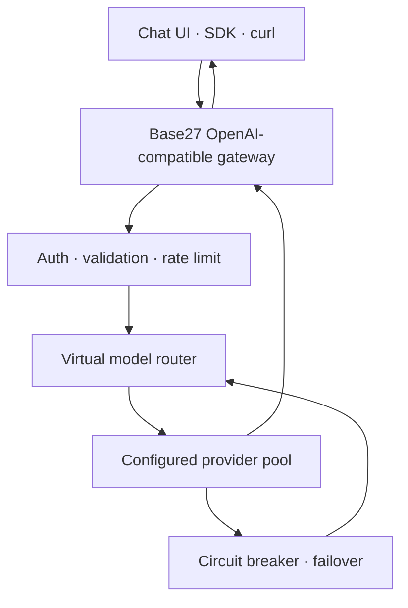

<div align="center">


# 🌐 Base27 Free LLM Router

### An OpenRouter-style free-tier gateway · OpenAI-compatible API · Vietnamese, English, and Chinese chat

[](../README.md)
[](README.en.md)
[](README.zh-CN.md)

</div>

> [!IMPORTANT]
> Victor Mustar's free DeepSeek‑V4‑Flash‑0731 endpoint has retired. This repository is now a self-hosted, multi-provider BYOK gateway. It does not distribute shared keys, rotate keys/IPs to evade limits, or promise absolute 24/7 availability from free upstream services.

## What it does

Your clients call one OpenAI-compatible endpoint:

```text
POST https://<your-gateway>/v1/chat/completions
```

The Worker maps a virtual model to a configured provider. On temporary failure, quota exhaustion, `429`, timeout, or server error, a circuit breaker pauses that provider and the request is tried sequentially against the next legitimate provider.

## Key capabilities

- OpenAI-compatible Chat Completions and Models endpoints.
- Virtual models: `free/auto`, `free/fast`, `free/reasoning`, and `free/coding`.
- Sequential failover: never duplicate one request across providers in parallel.
- Circuit breakers that honor `Retry-After`.
- Server-side BYOK secrets; provider keys never reach the browser.
- Optional gateway token, CORS, request validation, timeout, and best-effort IP rate limiting.
- Responsive trilingual chat with provider status and local conversation history.
- Eight adapters: OpenRouter, Groq, Gemini, Cerebras, Mistral, NVIDIA, Z.AI, and Hugging Face.

## Architecture



## Provider support

| Provider | Secret | Default mapping | Access type |
|---|---|---|---|
| OpenRouter | `OPENROUTER_API_KEY` | `openrouter/free` | Free Models Router, low quota |
| Groq | `GROQ_API_KEY` | Llama/GPT‑OSS | Model-specific free plan |
| Google AI Studio | `GEMINI_API_KEY` | `gemini-3.6-flash` | Project/region free tier |
| Cerebras | `CEREBRAS_API_KEY` | `gpt-oss-120b` | Trial credits; terms may require billing verification |
| Mistral | `MISTRAL_API_KEY` | Mistral Small/Codestral | Included Free mode usage |
| NVIDIA | `NVIDIA_API_KEY` | Llama/DeepSeek | Developer access limits |
| Z.AI | `ZAI_API_KEY` | `glm-4.7-flash` | Best-effort Flash access; verify account |
| Hugging Face | `HF_TOKEN`, `HF_MODEL` | Operator-selected | Provider/credit dependent |

Free access and model catalogs change frequently. The list was discovered through [nejib1/Free‑LLM](https://github.com/nejib1/Free-LLM) and checked against official provider documentation. Always verify current account limits.

## Deploy on Cloudflare Workers

```bash
git clone https://github.com/Base27-CVNSS/DeepSeek-V4-Flash-0731-free-endpoint.git
cd DeepSeek-V4-Flash-0731-free-endpoint
npm install
npx wrangler login

# Add only keys that belong to your accounts.
npx wrangler secret put OPENROUTER_API_KEY
npx wrangler secret put GROQ_API_KEY
npx wrangler secret put GEMINI_API_KEY

# Recommended for private/team use.
npx wrangler secret put GATEWAY_TOKEN

npm run check
npm run deploy
```

Set `APP_URL`, `ALLOWED_ORIGINS`, `PUBLIC_RPM`, `PUBLIC_BURST`, `MAX_PROVIDER_ATTEMPTS`, and `UPSTREAM_TIMEOUT_MS` in `wrangler.toml` before production deployment.

## API example

```bash
curl https://your-worker.workers.dev/v1/chat/completions \
  -H "Authorization: Bearer $GATEWAY_TOKEN" \
  -H "Content-Type: application/json" \
  -d '{
    "model": "free/auto",
    "messages": [{"role":"user","content":"Explain provider failover."}]
  }'
```

```python
from openai import OpenAI

client = OpenAI(
    base_url="https://your-worker.workers.dev/v1",
    api_key="YOUR_GATEWAY_TOKEN",
)

response = client.chat.completions.create(
    model="free/reasoning",
    messages=[{"role": "user", "content": "Explain Mixture of Experts."}],
)
print(response.choices[0].message.content)
```

Use `provider::model-id` to pin a request, for example `groq::openai/gpt-oss-120b`.

## Responsible availability

This architecture removes a single provider as a single point of failure, but it cannot make free quotas unlimited. For stronger reliability:

1. Configure at least three independent providers.
2. Monitor `/health` without generating artificial inference traffic.
3. Keep a budget-limited paid fallback for production.
4. Use durable state for distributed rate limits and circuit breakers.
5. Never create extra accounts, keys, or IP paths to bypass a provider's limits.

## Security

- Store provider credentials with `wrangler secret put`.
- Never put provider keys into frontend code.
- A public gateway without authentication can be abused and drain every free quota.
- Browser CORS is not bot protection.
- Prompts still pass through the selected provider; review each provider's data policy.
- Do not send sensitive, regulated, or confidential data to free tiers without approval.

## Tests

```bash
npm test
npm run check
```

Tests cover model mapping, provider targeting, payload normalization, `429` failover, terminal client errors, missing configuration, request validation, and rate limiting.

## Attribution and license

- Provider directory inspiration: [nejib1/Free‑LLM](https://github.com/nejib1/Free-LLM), MIT.
- Retired historical Space: [victor/DeepSeek‑V4‑Flash‑0731‑free‑endpoint](https://huggingface.co/spaces/victor/DeepSeek-V4-Flash-0731-free-endpoint).
- Current implementation: Base27‑CVNSS.

See [NOTICE.md](../NOTICE.md). Source code is licensed under the [MIT License](../LICENSE); provider APIs and models keep their own terms and licenses.
