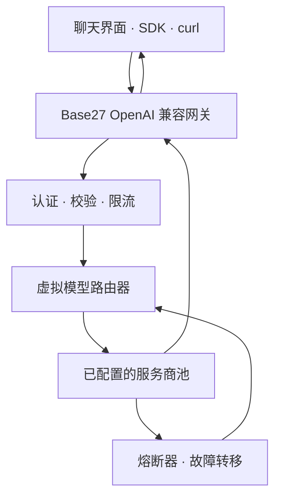

<div align="center">


# 🌐 Base27 Free LLM Router

### 类 OpenRouter 免费额度网关 · OpenAI 兼容 API · 越南语、英语、中文聊天

[](../README.md)
[](README.en.md)
[](README.zh-CN.md)

</div>

> [!IMPORTANT]
> Victor Mustar 提供的 DeepSeek‑V4‑Flash‑0731 免费端点已经停止服务。本仓库现已重构为可自行部署的多服务商 BYOK 网关。项目不分发共享密钥，不通过轮换密钥或 IP 规避限制，也不承诺所有免费上游都能绝对 24×7 可用。

## 项目用途

客户端只需要调用一个 OpenAI 兼容地址：

```text
POST https://<你的网关>/v1/chat/completions
```

Worker 将虚拟模型映射到已配置的真实服务商。当出现临时故障、额度耗尽、`429`、超时或服务器错误时，熔断器会暂停该服务商，并按顺序尝试下一个合法配置的服务商。

## 主要功能

- 兼容 OpenAI Chat Completions 与 Models API。
- 虚拟模型：`free/auto`、`free/fast`、`free/reasoning`、`free/coding`。
- 顺序故障转移：不会把同一个请求并行复制到多个服务商。
- 遵守 `Retry-After` 的熔断机制。
- BYOK 密钥仅保存在服务器端，不下发到浏览器。
- 可选网关令牌、CORS、请求校验、超时和按 IP 的 best-effort 限流。
- 响应式三语聊天界面、服务商状态和本地会话历史。
- 支持 OpenRouter、Groq、Gemini、Cerebras、Mistral、NVIDIA、Z.AI、Hugging Face。

## 架构



## 服务商适配器

| 服务商 | Secret | 默认模型映射 | 免费访问性质 |
|---|---|---|---|
| OpenRouter | `OPENROUTER_API_KEY` | `openrouter/free` | 免费模型路由，额度较低 |
| Groq | `GROQ_API_KEY` | Llama/GPT‑OSS | 按模型限制的免费计划 |
| Google AI Studio | `GEMINI_API_KEY` | `gemini-3.6-flash` | 按项目和地区限制 |
| Cerebras | `CEREBRAS_API_KEY` | `gpt-oss-120b` | 试用额度，可能要求账单验证 |
| Mistral | `MISTRAL_API_KEY` | Mistral Small/Codestral | Free mode 包含额度 |
| NVIDIA | `NVIDIA_API_KEY` | Llama/DeepSeek | 开发者访问限制 |
| Z.AI | `ZAI_API_KEY` | `glm-4.7-flash` | Flash/best-effort，需核对账户 |
| Hugging Face | `HF_TOKEN`、`HF_MODEL` | 由运营者选择 | 取决于 provider/credit |

免费额度和模型目录会频繁变化。初始候选来源于 [nejib1/Free‑LLM](https://github.com/nejib1/Free-LLM)，关键地址与模型再通过官方文档核对。请始终检查自己账户中的最新限制。

## 部署到 Cloudflare Workers

```bash
git clone https://github.com/Base27-CVNSS/DeepSeek-V4-Flash-0731-free-endpoint.git
cd DeepSeek-V4-Flash-0731-free-endpoint
npm install
npx wrangler login

# 只添加属于你自己的 API 密钥。
npx wrangler secret put OPENROUTER_API_KEY
npx wrangler secret put GROQ_API_KEY
npx wrangler secret put GEMINI_API_KEY

# 私人或团队使用时强烈建议设置。
npx wrangler secret put GATEWAY_TOKEN

npm run check
npm run deploy
```

生产部署前，请在 `wrangler.toml` 中配置 `APP_URL`、`ALLOWED_ORIGINS`、`PUBLIC_RPM`、`PUBLIC_BURST`、`MAX_PROVIDER_ATTEMPTS` 和 `UPSTREAM_TIMEOUT_MS`。

## API 示例

```bash
curl https://your-worker.workers.dev/v1/chat/completions \
  -H "Authorization: Bearer $GATEWAY_TOKEN" \
  -H "Content-Type: application/json" \
  -d '{
    "model": "free/auto",
    "messages": [{"role":"user","content":"解释服务商故障转移。"}]
  }'
```

```python
from openai import OpenAI

client = OpenAI(
    base_url="https://your-worker.workers.dev/v1",
    api_key="YOUR_GATEWAY_TOKEN",
)

response = client.chat.completions.create(
    model="free/reasoning",
    messages=[{"role": "user", "content": "解释混合专家模型。"}],
)
print(response.choices[0].message.content)
```

如需指定服务商和真实模型，可使用 `provider::model-id`，例如 `groq::openai/gpt-oss-120b`。

## 关于 24×7 可用性

多服务商架构可以降低单点故障风险，但不能把免费额度变成无限资源。为了提高可靠性：

1. 至少配置三个相互独立的服务商。
2. 监控 `/health`，不要制造无意义推理流量来“保活”。
3. 生产环境保留一个有预算上限的付费兜底服务商。
4. 使用 Durable Objects/KV 保存分布式限流与熔断状态。
5. 不得创建额外账户、密钥或 IP 路径来绕过服务商限制。

## 安全说明

- 使用 `wrangler secret put` 保存服务商密钥。
- 不要把服务商密钥写进前端。
- 没有认证的公开网关可能被滥用并耗尽所有免费额度。
- CORS 不是防机器人机制。
- Prompt 仍会经过被选择的服务商，请阅读其数据政策。
- 未经批准，不要向免费服务发送敏感、受监管或机密数据。

## 测试

```bash
npm test
npm run check
```

测试覆盖模型映射、指定服务商、payload 兼容处理、`429` 故障转移、不可重试客户端错误、缺少配置、请求校验和限流。

## 来源与许可证

- 免费 API 目录参考：[nejib1/Free‑LLM](https://github.com/nejib1/Free-LLM)，MIT。
- 已停止的历史 Space：[victor/DeepSeek‑V4‑Flash‑0731‑free‑endpoint](https://huggingface.co/spaces/victor/DeepSeek-V4-Flash-0731-free-endpoint)。
- 当前重构版本：Base27‑CVNSS。

详细信息见 [NOTICE.md](../NOTICE.md)。本项目源代码使用 [MIT License](../LICENSE)；第三方 API 与模型仍适用各自的服务条款和许可证。
